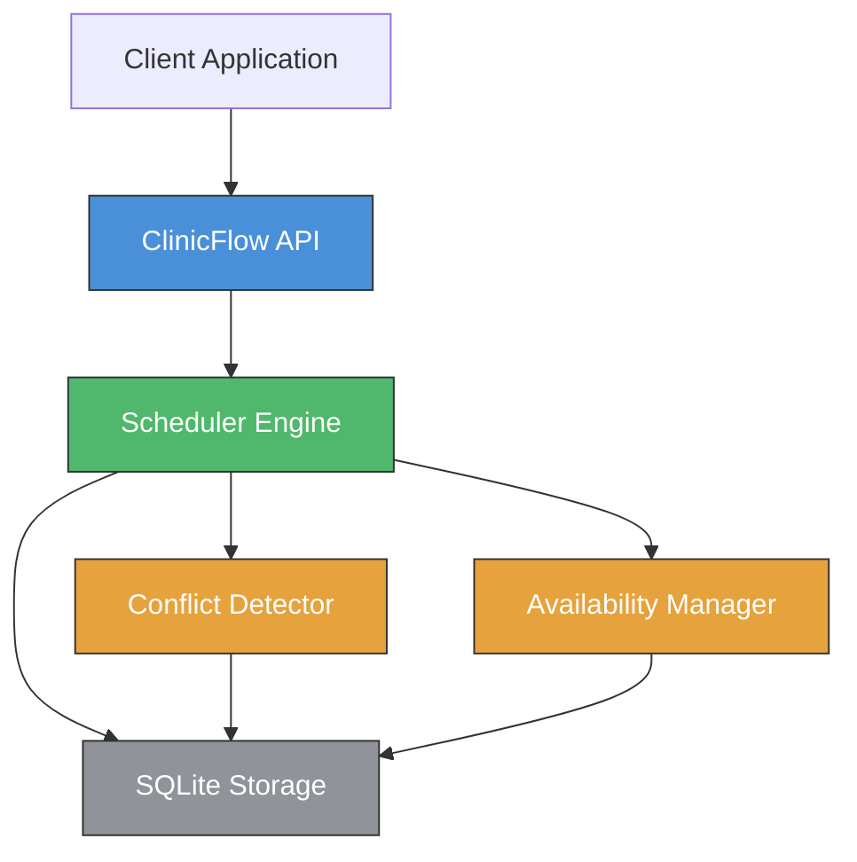

# ClinicFlow

[](https://github.com/officethree/ClinicFlow/actions/workflows/ci.yml)
[](https://www.python.org/downloads/)
[](LICENSE)
[](https://github.com/psf/black)

**Patient Appointment Scheduler** — A Python library for managing clinic appointments with intelligent scheduling, conflict detection, and availability management.

Inspired by healthcare scheduling AI trends.

---

## Architecture



## Quickstart

### Installation

```bash
pip install -e .
```

### Usage

```python
from clinicflow import ClinicFlow

# Initialize with in-memory database (or pass a file path)
clinic = ClinicFlow(db_path=":memory:")

# Add a provider
provider_id = clinic.add_provider(
    name="Dr. Smith",
    specialty="General Practice",
    hours={"start": "09:00", "end": "17:00"},
)

# Add a patient
patient_id = clinic.add_patient(
    name="Jane Doe",
    info={"phone": "555-0123", "email": "jane@example.com"},
)

# Schedule an appointment
from datetime import datetime
appt = clinic.schedule_appointment(
    patient_id=patient_id,
    provider_id=provider_id,
    dt=datetime(2026, 4, 1, 10, 0),
    duration=30,
)
print(f"Appointment ID: {appt['id']}")

# Find available slots
slots = clinic.find_available_slots(provider_id, "2026-04-01")
print(f"Available slots: {slots}")

# Get schedule
schedule = clinic.get_schedule(provider_id, "2026-04-01")
print(f"Today's schedule: {schedule}")

# Cancel an appointment
clinic.cancel_appointment(appt["id"])

# Get stats
stats = clinic.get_stats()
print(stats)
```

### Running Tests

```bash
make test
```

---

> **Disclaimer:** For educational purposes only. This software is not intended for use in production healthcare environments and does not comply with HIPAA or other healthcare regulations.

---

Built by **Officethree Technologies** | Made with love and AI
